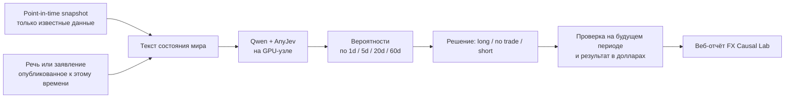

# AnyJev в FX Causal Lab

Дата проверки: 2026-09-27.

## Короткий вывод

AnyJev подходит как отдельный экспериментальный слой над открытой языковой моделью. Он получает описание состояния рынка и отвечает не свободным текстом, а вероятностями заранее заданных вариантов. Например: вероятность снижения, бокового движения и роста EUR/USD через 5 торговых дней.

AnyJev не превращает языковую модель в готового финансового предсказателя. Для каждого конкретного вопроса ему нужны исторические примеры с известным результатом. Его результат следует сравнивать с уже реализованными линейными и нелинейными моделями на одних и тех же датах.

## Что обнаружено на нашей инфраструктуре

- `192.168.88.15` — небольшая виртуальная машина Hermes: 4 CPU, 4 ГБ RAM, без вычислительной NVIDIA GPU.
- Qwen работает на отдельном GPU-узле `192.168.88.122`. Хост 15 обращается к нему через закрытый SSH-туннель `127.0.0.1:18081`.
- За туннелем сейчас загружена модель `/home/user/ai/qwen38-dflash/models/Qwen3.8-27B-UD-Q4_K_XL.gguf`: около 27,3 млрд параметров, GGUF Q4, контекст 65 536, сервер `llama.cpp`.
- Этот API отдаёт обычные ответы, но не промежуточное внутреннее состояние нужного слоя сети. Поэтому главный режим AnyJev L2 нельзя просто подключить к существующему endpoint.
- Установка тяжёлого model runtime на хост 15 не подходит по памяти и отсутствию GPU. На нём должны остаться FX Causal Lab, очередь заданий и веб-отчёт.

### Фактическая установка 2026-09-27

- GPU-узел доступен как `user@192.168.88.122`: NVIDIA RTX 3090 24 ГБ, 30 ГБ RAM, около 338 ГБ свободного места до установки.
- AnyJev закреплён на commit `45add301a7aa60ed3420c83d15c061e84e5bce61` и установлен отдельно в `/home/user/ai/anyjev-runtime` с Python 3.12.
- Полный `Qwen/Qwen3-8B` сохранён локально; из него создан checkpoint `/home/user/ai/anyjev-runtime/models/Qwen3-8B-b24` с первыми 24 из 36 блоков. Размер укороченных весов — около 11 ГБ.
- В свежем Qwen3 поле `layer_types` также содержит запись для каждого слоя. AnyJev 0.1.0 менял `num_hidden_layers`, но не сокращал этот список. Локальный минимальный патч сохранён в `tools/anyjev-qwen3-layer-types.patch`.
- Реальный smoke test на RTX 3090 прошёл: модель загрузилась, L2-голова обучилась на 12 искусственных примерах, вернула три вероятности и сохранилась в JSON. Полный процесс занял около 30 секунд. Этот результат проверяет только совместимость runtime и ничего не говорит о качестве прогноза EUR/USD.
- После теста автоматически восстановлены `qwen38-dflash.service` и `hermes-gpu-broker.service`; оба сервиса вернулись в состояние `ready`.

## Какую схему внедряем

### Разделение сервисов

1. **FX Causal Lab на хосте 15** строит point-in-time snapshot, сохраняет задания, результаты, версии модели и отчёты.
2. **AnyJev worker на GPU-узле** загружает отдельную совместимую Qwen-модель через Transformers или vLLM и возвращает вероятности.
3. **Существующий Qwen3.8-27B llama.cpp** остаётся рабочей моделью Hermes. Первый пилот не должен ломать или незаметно заменять этот сервис.
4. GPU broker получает отдельный профиль `anyjev`. Он переключает GPU между обычным Qwen, видео и AnyJev так же явно, как сейчас переключаются Qwen и ComfyUI.

Предпочтительный пилот — официальный `Qwen/Qwen3-8B` в vLLM. Для него авторы AnyJev рекомендуют читать состояние после 24-го из 36 блоков. Текущая 27B GGUF-модель не является готовой заменой этому checkpoint: формат, число слоёв и внутреннее представление должны совпадать с головой.

## Что именно спрашиваем у модели

Для каждого срока создаётся отдельный неизменяемый вопрос и отдельная AnyJev-голова:

- `fx_return_1d_v1` — движение EUR/USD за следующий торговый день;
- `fx_return_5d_v1` — движение за следующие 5 торговых дней;
- `fx_return_20d_v1` — движение за следующие 20 торговых дней;
- `fx_return_60d_v1` — движение за следующие 60 торговых дней.

Первый вариант ответа состоит из трёх классов:

1. `down` — снижение больше заранее зафиксированного порога;
2. `flat` — движение внутри нейтрального диапазона;
3. `up` — рост больше порога.

Пороги рассчитываются только по прошлому обучающему периоду. После первого зафиксированного теста их нельзя менять ради улучшения результата. Позже можно проверить пять диапазонов доходности, но начинать следует с трёх: для них больше примеров в каждом классе и проще понять качество вероятностей.

## Что подаём на вход

AnyJev получает короткий структурированный документ, собранный в `prediction_time`. В него входят:

- изменения EUR/USD, ставок США и еврозоны, нефти, VIX и фондовых индексов;
- CFTC, EIA и макроэкономические данные с возрастом каждого значения;
- состояние инфляции, роста, риска и ликвидности из deterministic DENN;
- только уже опубликованные к этому времени речи, решения и заявления;
- явные отметки `missing` и `unknown`, без заполнения будущими значениями.

Числа остаются числами и одновременно переводятся в понятные признаки: направление, сила относительно недавней истории, свежесть и изменение. Языковая модель не должна угадывать смысл длинной таблицы без такой подготовки.

## Как обучаем без подсматривания в будущее

AnyJev по умолчанию умеет выбирать настройки головы обычным перемешиванием примеров. Для финансовой истории это неприемлемо: будущие годы могут повлиять на настройку модели, которая формально предсказывает прошлое.

В FX Causal Lab используется только последовательная проверка:

1. модель и AnyJev-голова видят данные до конца года `T-2`;
2. год `T-1` используется для выбора настройки и проверки вероятностей;
3. год `T` остаётся полностью невидимым тестом;
4. затем окно сдвигается вперёд;
5. для целей 20 и 60 дней вводится разрыв между обучением и тестом, чтобы один ценовой отрезок не оказался с двух сторон границы.

Нельзя использовать `observe()` в историческом прогоне без нашего контроллера времени. Новая метка становится доступной только после окончания соответствующего горизонта.

## Как проверяем пользу

Для каждой даты сохраняются вероятности всех вариантов, выбранное действие и результат. Сравниваются:

- прогноз «изменение равно нулю»;
- обычное историческое среднее;
- существующая ElasticNet;
- нелинейная модель v0.23;
- AnyJev L0 без финансового обучения;
- AnyJev L2 с головой, обученной только на прошлом;
- AnyJev L2 без текстов и с текстами — чтобы отдельно измерить пользу заявлений.

В отчёте основной язык будет прикладным:

- сколько раз направление было угадано;
- насколько честны вероятности: события с оценкой 70% действительно происходили примерно в 70% случаев или нет;
- что стало с виртуальными 1 000 долларов при плече до 10, с учётом spread и комиссии;
- максимальная просадка;
- сколько было сделок и сколько раз модель отказалась торговать;
- в какие годы и режимы результат повторялся.

Сделка открывается только если ожидаемое движение перекрывает издержки и уверенность проходит заранее установленный порог. Иначе результат — `no trade`.

## Особый риск исторических текстов

Qwen мог видеть старые речи центробанков и последующие события во время первоначального обучения. Поэтому вопрос «куда пошёл EUR/USD после речи 2018 года» может частично проверять память модели, а не прогноз.

Для исторических текстов сначала проверяется более узкая задача: извлечь из текста тон и темы — ужесточение или смягчение политики, инфляционный риск, риск роста, тарифы, санкции, финансовый стресс. Эти признаки затем входят в прогнозную модель. Прямой AnyJev-прогноз по тексту считается исследовательским и получает отдельную отметку о возможном знании будущего. Самая надёжная проверка — замороженные ежедневные прогнозы на новых данных после запуска системы.

## Что сохраняем для воспроизводимости

Каждый прогноз содержит:

- `prediction_time` и максимальный `available_at` входных данных;
- идентификатор и хеш snapshot;
- точную формулировку вопроса и порядок вариантов;
- модель, revision/checkpoint, число использованных блоков и версию AnyJev;
- версию и хеш обученной головы;
- все вероятности, выбранный класс и правило сделки;
- время, когда будущий результат стал известен;
- результат в пунктах, процентах и долларах.

## Порядок работ

### A0 — проверка железа и отдельного runtime

- **Выполнено:** получен SSH-доступ, зафиксированы GPU/VRAM/RAM/диск и версии runtime.
- **Выполнено:** Qwen3-8B сокращён до 24 блоков и успешно загружен на RTX 3090.
- **Выполнено:** после отдельного теста работающий `qwen38-dflash.service` восстановлен и проверен.
- **Осталось:** добавить в GPU broker отдельную строго проверяемую операцию `anyjev`, не принимающую произвольный код.

### A1 — локальный контракт в FX Causal Lab

- добавить schema задания и результата;
- детерминированно собирать текст world state;
- добавить четыре versioned questions;
- сохранять решения и показывать их в веб-интерфейсе;
- создать fake worker для полной проверки цепочки без GPU.

### A2 — реальный Qwen3-8B + AnyJev

- закрепить commit AnyJev и checkpoint Qwen;
- развернуть отдельный vLLM embed service;
- получить внутреннее состояние фиксированного блока;
- обучить головы на прошлых данных и экспортировать артефакты;
- проверить, что после перезапуска вероятности воспроизводятся.

### A3 — честный исторический эксперимент

- начать только с числового structured state;
- провести последовательную годовую проверку 1d/5d/20d/60d;
- сравнить с существующими моделями;
- опубликовать понятный денежный отчёт;
- остановить ветку, если она не добавляет устойчивой пользы.

### A4 — речи и политико-экономические заявления

- собрать официальные архивы Fed, ECB, BIS и государственных источников;
- сохранить точное время публикации и исходный текст;
- получить признаки тона и тем без знания будущей цены;
- повторить тот же эксперимент с текстом и без текста;
- после запуска вести настоящий ежедневный shadow forecast.

## Условие перехода к эксплуатации

AnyJev остаётся исследовательским источником вероятностей. Он не управляет реальными сделками. Переход к использованию сигнала возможен, только если на нескольких последовательных периодах он улучшает обычные модели, сохраняет приемлемую просадку и его заявленные вероятности совпадают с наблюдаемой частотой исходов.
