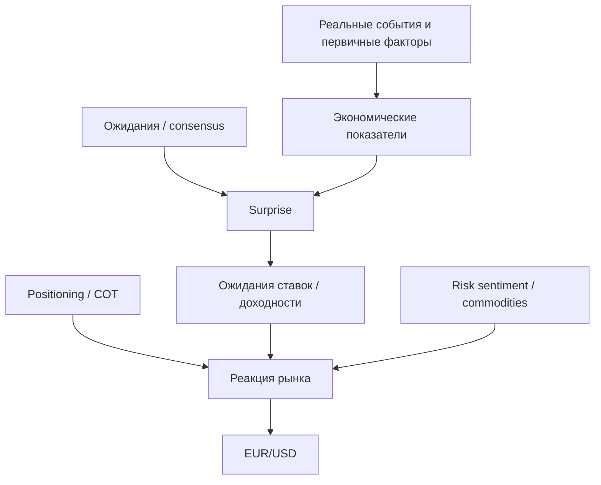

# FX Causal Lab
## Техническая спецификация исследовательской системы EUR/USD

**Цель:** построить воспроизводимую исследовательскую систему, которая связывает внешние экономические события, ожидания, фактические релизы, рыночные промежуточные переменные и позиционирование с последующим движением EUR/USD на горизонтах от часов до месяцев.

**Первый этап:** исторический backfill примерно за 3 года (2023-09-23 → 2026-09-23), EUR/USD, H1/D1, экономические факторы. Минутные данные не являются основным источником. Политические и геополитические события закладываются в схему, но не входят в обязательный MVP.

---

## 1. Ключевая идея проекта

Проект не должен искать «магическую формулу» непосредственно в графике EUR/USD. Цена является конечным наблюдаемым результатом цепочки:



Нас интересуют не только значения показателей, но и:

- **ожидание до публикации**;
- **фактическое значение**;
- **расхождение Actual − Consensus (surprise)**;
- **пересмотр предыдущего значения**;
- **изменение ожиданий до релиза**;
- **рыночная интерпретация** через ставки/доходности/риск;
- **позиционирование участников** до события;
- **временной лаг**, на котором эффект проявляется.

Главная исследовательская задача:

> При каких комбинациях событий, ожиданий, макропоказателей, ставок, позиционирования и состояния рынка вероятность/ожидаемая величина движения EUR/USD статистически отличается от базового сценария и сохраняется out-of-sample?

---

## 2. Важное ограничение: causal graph ≠ доказанная причинность

Граф должен хранить **гипотезы о причинных связях**, а статистический слой — проверять их. Ребро `OilPrice -> InflationExpectation` не должно считаться истиной только потому, что оно логично.

Для каждого ребра требуется хранить:

- направление влияния: `positive / negative / mixed / unknown`;
- ожидаемый горизонт: часы / дни / недели / месяцы;
- лаг `lag_min`, `lag_max`;
- тип доказательства: теория, официальный источник, event study, regression, Granger/predictive, ML feature importance;
- sample size;
- effect size / beta;
- confidence interval;
- p-value (если применимо);
- стабильность по временным подвыборкам;
- дату последней проверки;
- ссылки на исходные данные и код эксперимента.

Таким образом OpenSPG хранит **семантику и provenance**, но не заменяет econometrics.

---

## 3. Временные масштабы

### 3.1 Fast: часы

Примеры:
- CPI, NFP, PCE;
- FOMC / ECB rate decision;
- неожиданная публикация;
- резкая реакция доходностей.

Targets:
- `return_1h`;
- `return_4h`;
- `mfe_4h`, `mae_4h`;
- изменение realized volatility.

### 3.2 Medium: дни–недели

Примеры:
- изменение ожиданий денежной политики;
- тренд нефти/энергии;
- CFTC positioning;
- серия пересмотров макроданных;
- относительная динамика US/EU growth/inflation.

Targets:
- `return_1d`;
- `return_5d`;
- `return_20d`.

### 3.3 Slow: месяцы

Примеры:
- относительный рост США/еврозоны;
- циклы ставок;
- производительность;
- устойчивые изменения занятости;
- структурные энергориски.

Targets:
- `return_60d`;
- режим EUR/USD;
- изменение долгосрочной волатильности.

**Основная частота MVP:** H1 для короткого горизонта и D1 для средне-/долгосрочного. Минутки можно сохранить только как optional event microstructure dataset позже.

---

## 4. Каузальная структура EUR/USD

### 4.1 Уровень 0 — Target

`EUR/USD`

Храним:
- OHLC H1;
- OHLC D1;
- лог-доходности;
- ATR/realized volatility как state variables;
- forward returns на 1h/4h/1d/5d/20d/60d;
- MFE/MAE на соответствующих горизонтах.

### 4.2 Уровень 1 — ближайшие рыночные драйверы

1. **Относительные ожидания ставок US vs Euro Area**
   - US 2Y / German 2Y;
   - US 10Y / German 10Y;
   - slope/yield curve;
   - изменение спреда ставок.

2. **Относительные ожидания инфляции и роста**
   - surprise и trend соответствующих индикаторов;
   - пересмотры;
   - survey expectations.

3. **Risk-on / risk-off**
   - VIX;
   - S&P 500 / европейские индексы (опционально);
   - золото;
   - кредитные/финансовые условия (опционально).

4. **Positioning**
   - CFTC TFF: Leveraged Funds, Asset Managers, Dealers, Other Reportables;
   - net position / open interest;
   - percentile/z-score;
   - weekly change.

5. **Commodity / energy channel**
   - WTI/Brent;
   - crude inventories;
   - US production/import/export;
   - gasoline/diesel prices.

### 4.3 Уровень 2 — опубликованные экономические показатели

#### США
- CPI / Core CPI;
- PCE / Core PCE;
- Nonfarm Payrolls;
- unemployment rate;
- average hourly earnings;
- JOLTS;
- initial/continuing claims;
- GDP;
- retail sales;
- industrial production;
- housing/construction;
- international trade;
- Fed rate decision / FOMC statement / SEP.

#### Еврозона / Германия
- HICP / Core HICP;
- GDP;
- unemployment;
- industrial production;
- retail trade;
- trade balance;
- Economic Sentiment Indicator (ESI);
- Employment Expectations Indicator (EEI);
- consumer confidence;
- German CPI/GDP/production (Destatis);
- ECB rate decision / communication.

### 4.4 Уровень 3 — «первообразы» / компоненты индикаторов

Пример инфляции:

`EIA energy data -> gasoline/oil -> energy component -> CPI/HICP -> policy expectations -> yield spread -> EUR/USD`

Пример труда:

`Initial claims + JOLTS + sector payrolls + wage data -> labor-market state -> NFP/unemployment/wage surprise -> Fed expectations -> EUR/USD`

Пример экономической активности:

`retail + orders + construction + sentiment -> growth expectation -> GDP surprise / rate path -> EUR/USD`

### 4.5 Уровень 4 — внешние события

В MVP хранится только schema. Реальный ingestion позже:
- санкции;
- войны/блокада/морские риски;
- OPEC decisions;
- погодные/энергетические шоки;
- крупные регуляторные решения;
- системные банковские события;
- технологические/структурные события.

Для таких событий нужно отдельно различать **observed fact** и **inferred explanation**.

---

## 5. Источники данных

### 5.1 Официальные / первичные

| Источник | Данные | Интерфейс | Роль в MVP |
|---|---|---|---|
| CFTC | TFF COT, positioning | API / yearly historical files | Да |
| BLS | CPI, employment, wages, PPI, JOLTS | REST API + RSS | Да |
| BEA | GDP, PCE, income/outlays | API + release schedule | Да |
| Census | retail, housing, trade, manufacturing | Economic Indicators API | Да |
| Federal Reserve | FOMC, rates, H.10/H.15, releases | RSS + FRED/DDP | Да |
| FRED/ALFRED | rates, yields, vintages/revisions | REST API | Да |
| Eurostat | HICP, GDP, unemployment, production, trade | SDMX/API + release calendar | Да |
| ECB | rates, exchange rates, euro-area data | SDMX REST API | Да |
| Destatis GENESIS | German CPI/GDP/industrial data | REST/JSON API | Да, 2-я очередь |
| DG ECFIN BCS | ESI/EEI/consumer & business surveys | SDMX/ZIP/API | Да, 2-я очередь |
| EIA | oil, inventories, production, prices | API v2 + WPSR | Да |
| US DOL/ETA | weekly UI claims | releases/files | Да |

### 5.2 Consensus / expected values

Официальные ведомства публикуют **Actual**, но рыночный consensus обычно является частной агрегированной оценкой.

Для MVP:
- **Trading Economics Economic Calendar / Point-in-Time** как практический источник `forecast/consensus`, historical snapshots и event metadata.
- В таблице происхождения обязательно хранить `source=tradingeconomics` отдельно от official actual.
- Перед production проверить лицензию/лимиты и при необходимости заменить/дублировать профессиональным vendor feed.

### 5.3 Цена EUR/USD

- основной H1/D1 ряд: **MetaTrader 5 broker data** (тот же поток, где потенциально будет исполнение);
- ежедневная независимая сверка: **ECB reference exchange rates**;
- отдельное поле `provider` обязательно, потому что FX spot не имеет одной централизованной «официальной» цены.

---

## 6. Проверенные ссылки для разработчика

### CFTC
- COT overview: https://www.cftc.gov/MarketReports/CommitmentsofTraders/index.htm
- About COT: https://www.cftc.gov/MarketReports/CommitmentsofTraders/AbouttheCOTReports/cot_about.html
- Historical compressed: https://www.cftc.gov/MarketReports/CommitmentsofTraders/HistoricalCompressed/index.htm
- Historical viewable: https://www.cftc.gov/MarketReports/CommitmentsofTraders/HistoricalViewable/index.htm

### BLS
- API: https://www.bls.gov/developers/
- API v2 signatures: https://www.bls.gov/developers/api_signature_v2.htm
- RSS: https://www.bls.gov/feed/

### BEA
- API: https://apps.bea.gov/api/signup/
- Release schedule: https://www.bea.gov/news/schedule

### Census
- Economic Indicators API: https://www.census.gov/data/developers/data-sets/economic-indicators.html

### Federal Reserve / FRED
- FOMC calendar: https://www.federalreserve.gov/monetarypolicy/fomccalendars.htm
- Federal Reserve RSS: https://www.federalreserve.gov/feeds/feeds.htm
- FRED API: https://fred.stlouisfed.org/docs/api/fred/
- ALFRED: https://fred.stlouisfed.org/docs/api/fred/alfred.html
- Series observations/vintages: https://fred.stlouisfed.org/docs/api/fred/series_observations.html

### Eurostat / EU
- Eurostat APIs: https://ec.europa.eu/eurostat/web/user-guides/data-browser/api-data-access/
- SDMX 3.0 guide: https://ec.europa.eu/eurostat/web/user-guides/data-browser/api-data-access/api-getting-started/sdmx3.0
- Release calendar: https://ec.europa.eu/eurostat/news/euro-indicators/release-calendar
- DG ECFIN BCS: https://economy-finance.ec.europa.eu/economic-forecast-and-surveys/business-and-consumer-surveys_en

### ECB
- API overview: https://data.ecb.europa.eu/help/api/overview
- API data examples: https://data.ecb.europa.eu/help/api/data-examples

### Germany
- Destatis GENESIS API: https://www.destatis.de/EN/Service/OpenData/api-webservice.html

### Energy / labor
- EIA Open Data API: https://www.eia.gov/opendata/
- EIA API docs: https://www.eia.gov/opendata/documentation.php
- Weekly Petroleum Status Report: https://www.eia.gov/petroleum/supply/weekly/
- DOL ETA releases: https://www.dol.gov/newsroom/releases/ETA

### Consensus
- Trading Economics point-in-time calendar: https://docs.tradingeconomics.com/economic_calendar/point-in-time/

### Knowledge graph
- OpenSPG: https://github.com/OpenSPG/openspg
- KAG: https://github.com/OpenSPG/KAG

---

## 7. Point-in-time правило — главное требование проекта

Любой backtest обязан видеть только данные, которые реально были доступны в тот момент.

Для каждой записи нужны минимум:

```text
observation_period      # период, к которому относится показатель
scheduled_release_at    # плановое время публикации
released_at             # фактическое время публикации, если известно
received_at             # когда наш collector получил данные
valid_from              # когда запись разрешено использовать в модели
revision_number
revision_of
vintage_date
source
source_url
raw_payload_hash
```

Пример COT:
- позиции относятся к Tuesday close;
- CFTC публикует weekly report обычно Friday 15:30 ET;
- `valid_from` = release timestamp, а не Tuesday report date.

CFTC прямо указывает, что weekly report отражает Tuesday open interest и публикуется в Friday 15:30; historical viewable даты являются report date, а не release date.

Пример GDP:
- нельзя подставлять в 2024 год значение, которое было пересмотрено в 2026;
- ALFRED/FRED vintages должны восстанавливать «что рынок знал тогда».

**Любой feature без корректного `valid_from` запрещён для обучения.**

---

## 8. Слой хранения

Не хранить всё в OpenSPG.

### Bronze — immutable raw

Формат:
- raw HTTP/JSON/XML/CSV payload;
- timestamp запроса;
- headers;
- SHA-256;
- source URL;
- parser version.

Рекомендуется:
- `data/raw/<source>/<yyyy>/<mm>/<dd>/...`
- MinIO/S3 позже; локальная FS допустима для MVP.

### Silver — normalized observations/events

Рекомендуется:
- Parquet + DuckDB для исследования;
- PostgreSQL/TimescaleDB для operational metadata и incremental ingestion.

Основные таблицы:
- `fx_bars`;
- `macro_observation`;
- `macro_release`;
- `expectation_snapshot`;
- `market_series`;
- `cot_positioning`;
- `event`;
- `source_registry`;
- `data_vintage`.

### Gold — features / labels

- `feature_snapshot_h1`;
- `feature_snapshot_d1`;
- `event_study_features`;
- `targets_h1`;
- `targets_d1`.

### Graph — OpenSPG

OpenSPG хранит:
- сущности;
- семантические связи;
- причинные гипотезы;
- provenance;
- результаты тестирования связи;
- links на реальные observation IDs.

Не дублировать миллионы H1 наблюдений как graph nodes.

---

## 9. OpenSPG schema v0

### Node types

```text
CurrencyPair
Currency
Country
EconomicIndicator
EconomicRelease
Expectation
Surprise
MarketVariable
InterestRate
Commodity
PositioningMetric
PolicyDecision
Organization
ExternalEvent
Sector
Hypothesis
Experiment
DataSource
```

### Edge types

```text
AFFECTS
CAUSES_HYPOTHESIS
COMPONENT_OF
PUBLISHED_BY
EXPECTED_BY
SURPRISE_OF
LEADS
CORRELATES_WITH
MEDIATED_BY
VALIDATED_BY
CONTRADICTED_BY
DERIVED_FROM
```

### Edge properties

```text
sign                # +1 / -1 / mixed / unknown
lag_min
lag_max
horizon_unit
confidence
empirical_beta
p_value
sample_size
stability_score
valid_from
valid_to
last_tested_at
experiment_id
source_ids[]
```

### Пример пути

```text
EIA.CrudeInventoryChange
    -> OilPrice
    -> USInflationExpectation
    -> FedRateExpectation
    -> US2Y
    -> US_DE_2Y_Spread
    -> EURUSD
```

---

## 10. Нормализованная схема событий

```json
{
  "event_id": "uuid",
  "event_type": "MACRO_RELEASE",
  "country": "US",
  "indicator": "CPI_CORE_MOM",
  "observation_period": "2026-08",
  "scheduled_release_at": "2026-09-11T08:30:00-04:00",
  "released_at": "2026-09-11T08:30:00-04:00",
  "received_at": "2026-09-11T08:30:02.184-04:00",
  "actual": 0.3,
  "consensus": 0.2,
  "previous_as_known": 0.2,
  "previous_revised": 0.3,
  "unit": "percent_mom",
  "source_actual": "BLS",
  "source_consensus": "TradingEconomics",
  "raw_refs": ["..."],
  "revision_number": 0
}
```

Derived:

```text
surprise_raw       = actual - consensus
surprise_z         = robust_z(actual - consensus)
revision_surprise  = previous_revised - previous_as_known
consensus_drift_7d = consensus_at_release - consensus_7d_before
```

Использовать robust z-score (median/MAD) как альтернативу std при выбросах.

---

## 11. Feature groups

### 11.1 Release features
- actual;
- consensus;
- previous_as_known;
- revision;
- surprise_raw;
- surprise_z;
- consensus drift;
- days since previous release.

### 11.2 Relative US/EU features

Для EUR/USD абсолютный показатель часто менее полезен, чем relative state:

```text
US_inflation_surprise - EA_inflation_surprise
US_growth_surprise    - EA_growth_surprise
US_2Y                 - DE_2Y
Δ(US_2Y - DE_2Y)
US_sentiment_z         - EA_sentiment_z
```

### 11.3 COT

```text
leveraged_net
asset_manager_net
dealer_net
net_pct_open_interest
weekly_delta
4w_delta
26w_zscore
52w_percentile
crowding_flag
```

### 11.4 Oil/energy

```text
WTI level/return
inventory_change
production_change
imports_exports_delta
refinery_utilization
gasoline_price_change
```

При наличии consensus для inventory:

```text
inventory_surprise = actual_change - expected_change
```

### 11.5 Market state

```text
EURUSD trend/vol regime
VIX level/change
US2Y/US10Y
DE2Y/DE10Y
yield spread
DXY (optional)
gold return
SPX return
```

State variables не считаются «причиной» автоматически; они помогают условить реакцию.

---

## 12. Targets

### H1 dataset

На timestamp `t`:

```text
ret_1h
ret_4h
ret_24h
mfe_4h
mae_4h
mfe_24h
mae_24h
vol_24h_forward
```

### D1 dataset

```text
ret_1d
ret_5d
ret_20d
ret_60d
mfe_20d
mae_20d
vol_20d_forward
```

Лучше прогнозировать не только sign, но и распределение/expected return.

---

## 13. Исторический backfill

### MVP window

`2023-09-23 → 2026-09-23`

Цель трёхлетнего окна:
- проверить ingestion;
- проверить point-in-time alignment;
- построить первый граф;
- найти очевидно бесполезные/полезные группы признаков;
- получить end-to-end research pipeline.

### Ограничение

3 года дают приблизительно:
- ~780 торговых дней;
- ~18 000 H1 баров;
- ~156 COT отчётов;
- ~36 CPI релизов;
- ~36 NFP релизов;
- ~24 FOMC meetings.

Количество H1 баров **не превращает 36 CPI релизов в 18 000 независимых CPI наблюдений**.

После MVP система должна уметь переключиться на 8–15 лет истории без изменения schema. Для финальной статистической валидации долгий backfill почти наверняка потребуется.

---

## 14. Исследовательские методы

### Stage A — data audit

Для каждого series/event:
- missingness;
- revisions;
- duplicate releases;
- timestamp quality;
- outliers;
- unit consistency;
- timezone consistency;
- source disagreements.

### Stage B — descriptive/event study

Для каждого event type:
- mean/median forward return;
- distribution by surprise buckets;
- MFE/MAE;
- reaction by market regime;
- reaction by COT crowding;
- reaction by rate differential.

Buckets:

```text
surprise_z < -2
-2 .. -1
-1 .. 0
0 .. +1
+1 .. +2
> +2
```

### Stage C — lead/lag tests

- cross-correlation с правильными lag;
- distributed-lag regression;
- local projections по горизонтам;
- Granger causality только как **predictive precedence**, не как доказательство причинности.

### Stage D — interpretable models

Baselines:
1. zero expected return;
2. historical mean;
3. autoregressive price-only baseline;
4. event-only regression.

Models:
- OLS / robust regression;
- logistic regression для sign;
- Elastic Net/Lasso;
- quantile regression;
- local projections.

### Stage E — nonlinear

Только после baseline:
- Random Forest;
- XGBoost/LightGBM;
- shallow neural model при необходимости.

Использовать SHAP/partial dependence только как diagnostic, а не доказательство причинности.

### Stage F — graph-aware features

Пример:

```text
path_score = Σ(edge_weight × recent_node_shock × decay(lag))
```

Сравнить:
- flat feature model;
- graph-derived feature model.

Если граф не улучшает out-of-sample результат, не оправдывать его эстетикой.

---

## 15. Валидация и борьба с самообманом

Запрещено:
- random shuffle train/test;
- использовать future revisions;
- подбирать параметры на test set;
- выбирать «лучший» из сотен экспериментов без поправки на multiple testing;
- считать causal связь по одной корреляции.

### Walk-forward

Для трёх лет можно использовать, например:
- Train: первые 18 месяцев;
- Validation: следующие 6;
- Test: последние 12;

и rolling/expanding variants.

После расширения истории использовать несколько walk-forward folds.

### Метрики

Статистические:
- out-of-sample R²;
- MAE/RMSE;
- directional accuracy;
- log loss / Brier score для вероятностей;
- rank IC / Spearman;
- calibration.

Экономические (только после формирования торгового правила):
- return after spread/slippage;
- Sharpe/Sortino;
- max drawdown;
- turnover;
- profit factor;
- tail losses.

### Multiple testing

Если тестируются десятки/сотни факторов:
- Benjamini-Hochberg FDR;
- bootstrap/permutation;
- хранить registry всех экспериментов, а не только удачных.

---

## 16. Предлагаемый стек

### Python

- Python 3.12;
- `httpx` / `requests`;
- `pydantic`;
- `polars`;
- `pyarrow`;
- `duckdb`;
- `pandas` при необходимости совместимости;
- `statsmodels`;
- `scikit-learn`;
- `xgboost` или `lightgbm` позже;
- `networkx` для локальных graph experiments.

### Storage

MVP:
- Parquet;
- DuckDB;
- SQLite/PostgreSQL для registry.

Phase 2:
- PostgreSQL/TimescaleDB;
- MinIO;
- OpenSPG.

### Graph

**OpenSPG** логично использовать как semantic/knowledge layer. Он поддерживает schema-based modeling, structured/unstructured knowledge construction и KAG для multi-hop reasoning. Но статистические time series остаются вне графа.

### Orchestration

Начать без лишнего Kubernetes-цирка:
- CLI collectors;
- cron/systemd timers.

После стабилизации:
- Prefect/Dagster по необходимости.

---

## 17. Структура репозитория

```text
fx-causal-lab/
├── README.md
├── pyproject.toml
├── .env.example
├── config/
│   ├── sources.yaml
│   ├── indicators.yaml
│   ├── graph_schema.yaml
│   └── experiments.yaml
├── src/fxlab/
│   ├── ingest/
│   │   ├── base.py
│   │   ├── bls.py
│   │   ├── bea.py
│   │   ├── census.py
│   │   ├── fed.py
│   │   ├── fred.py
│   │   ├── cftc.py
│   │   ├── eurostat.py
│   │   ├── ecb.py
│   │   ├── eia.py
│   │   ├── destatis.py
│   │   ├── tradingeconomics.py
│   │   └── mt5.py
│   ├── normalize/
│   ├── features/
│   ├── graph/
│   ├── research/
│   ├── backtest/
│   └── cli.py
├── data/
│   ├── raw/
│   ├── silver/
│   └── gold/
├── notebooks/
├── reports/
├── tests/
│   ├── fixtures/
│   ├── test_point_in_time.py
│   ├── test_revisions.py
│   └── test_collectors.py
└── docker/
```

---

## 18. Интерфейс collector

Каждый source adapter должен реализовать одинаковый контракт:

```python
class SourceAdapter(Protocol):
    source_name: str

    def discover(self) -> list[DatasetDescriptor]: ...
    def backfill(self, start, end) -> Iterable[RawRecord]: ...
    def update(self, since) -> Iterable[RawRecord]: ...
    def normalize(self, raw: RawRecord) -> Iterable[NormalizedRecord]: ...
```

Обязательные свойства:
- idempotency;
- retries/backoff;
- raw response persistence;
- schema/version logging;
- checksum;
- timezone normalization to UTC;
- unit metadata;
- deterministic re-run.

---

## 19. Source registry

`config/sources.yaml` должен стать центральным реестром:

```yaml
sources:
  bls:
    authority: official
    base_url: https://api.bls.gov
    api_key_env: BLS_API_KEY
    supports_history: true
    supports_revisions: partial
    point_in_time: false

  fred:
    authority: official_fed
    base_url: https://api.stlouisfed.org
    api_key_env: FRED_API_KEY
    supports_history: true
    supports_revisions: true
    point_in_time: true

  tradingeconomics:
    authority: commercial_aggregator
    api_key_env: TRADING_ECONOMICS_KEY
    role: consensus
    point_in_time: true
```

---

## 20. Первые эксперименты

### Experiment 001 — rate spread baseline

Гипотеза:

`Δ(US2Y - DE2Y)` имеет предсказательную связь с EUR/USD на 1d/5d.

Сравнить:
- level;
- daily delta;
- z-score;
- interaction с risk regime.

### Experiment 002 — CPI surprise

`US CPI/Core CPI surprise_z -> EURUSD 1h/4h/1d`

Контролировать:
- simultaneous releases;
- yield spread reaction;
- pre-event EURUSD trend;
- COT crowding.

### Experiment 003 — NFP complex

Использовать одновременно:
- payroll surprise;
- unemployment surprise;
- wage surprise;
- previous payroll revision.

Не сводить Employment Situation к одному headline NFP.

### Experiment 004 — ECB/Fed relative policy

Построить state:

```text
US policy surprise - EA policy surprise
```

и проверить 1d/5d/20d.

### Experiment 005 — COT as modifier, not standalone signal

Проверить interaction:

```text
macro_surprise × leveraged_funds_crowding
```

Гипотеза: одинаковая новость может давать разную реакцию при crowded vs neutral positioning.

### Experiment 006 — oil causal chain

```text
EIA inventory/production shock
 -> oil return
 -> inflation/rate expectation proxies
 -> EURUSD
```

Сравнить direct path и mediated path.

---

## 21. Roadmap для Codex

### Milestone 0 — Bootstrap

**Deliverables**
- repo;
- `pyproject.toml`;
- config system;
- logging;
- unit test framework;
- `sources.yaml`;
- common schemas.

**Acceptance**
- `python -m fxlab --help` работает;
- все timestamps timezone-aware;
- raw payload может быть сохранён и повторно нормализован offline.

### Milestone 1 — Market target

- import EUR/USD H1/D1 from MT5;
- resample/validate;
- create forward targets;
- ECB daily cross-check.

**Acceptance**
- continuous trading calendar;
- gap report;
- deterministic Parquet output.

### Milestone 2 — Official US ingestion

Implement:
- BLS;
- BEA;
- Census;
- Fed/FRED/ALFRED;
- DOL;
- EIA.

**Acceptance**
- 3-year backfill;
- source provenance;
- revisions/vintages where available;
- release timestamps.

### Milestone 3 — EU ingestion

Implement:
- Eurostat;
- ECB;
- DG ECFIN BCS;
- Destatis.

### Milestone 4 — CFTC

- TFF Futures Only;
- currencies relevant to EUR/USD;
- release-date correction;
- normalized COT features.

### Milestone 5 — Consensus

- Trading Economics adapter;
- historical point-in-time calendar;
- map event names to canonical indicator IDs;
- build Actual/Consensus/Revision features.

### Milestone 6 — Feature store

- H1 snapshot builder;
- D1 snapshot builder;
- strict `valid_from <= prediction_time` assertion;
- relative US/EU features;
- lag generation.

### Milestone 7 — OpenSPG

- schema deploy;
- curated initial edges;
- ingest provenance links;
- store experiment results on edges.

### Milestone 8 — Research report v1

Generate automatically:
- source coverage;
- missingness;
- event counts;
- correlation/lead-lag matrix;
- event studies;
- baseline models;
- walk-forward results;
- graph edge score updates.

### Milestone 9 — Decision gate

Продолжать к live system только если есть хотя бы один эффект, который:
1. сохраняется out-of-sample;
2. устойчив к разумной смене параметров;
3. имеет экономически понятный механизм;
4. не исчезает после realistic costs;
5. не является результатом look-ahead/revisions/multiple testing.

---

## 22. Что Codex должен сделать первым

Порядок выполнения, без попытки «сразу написать AI-трейдера»:

1. Создать repo и schemas.
2. Реализовать `source_registry` и raw snapshot format.
3. Подключить MT5 H1/D1 + ECB daily validation.
4. Подключить FRED/ALFRED и доказать на тесте, что vintage handling работает.
5. Подключить BLS и Eurostat.
6. Подключить CFTC с правильным release lag.
7. Подключить EIA.
8. Подключить Trading Economics point-in-time.
9. Сделать unified canonical indicator mapping.
10. Backfill 3 года.
11. Провести data quality report.
12. Только после этого строить features и первые regressions.
13. OpenSPG подключать после появления чистых canonical entities; до этого использовать YAML schema/NetworkX prototype.

---

## 23. Критические тесты

### Test: no-lookahead

Для случайных 1 000 prediction timestamps:

```text
assert every_feature.valid_from <= prediction_timestamp
```

### Test: revision leakage

Для показателя с revisions сравнить:
- current final value;
- vintage visible at timestamp.

Feature builder обязан выбрать vintage.

### Test: COT lag

Tuesday report date не должен появляться в features до Friday release.

### Test: source mismatch

Если official actual != aggregator actual:
- official wins;
- discrepancy logged;
- aggregator consensus сохраняется отдельно.

### Test: deterministic backfill

Повторный ingestion одинакового периода не создаёт дубликаты и даёт одинаковые normalized hashes.

---

## 24. Что не делать в MVP

- не начинать с minute/tick microstructure;
- не строить LSTM/Transformer до baseline;
- не загружать миллионы ценовых баров в knowledge graph;
- не считать любую новость causal event без provenance;
- не использовать сегодняшние revised macro values для исторического prediction time;
- не оптимизировать торговую стратегию до подтверждения predictive edge;
- не смешивать fast и slow effects в один label;
- не интерпретировать feature importance как причинность.

---

## 25. Ожидаемый результат первого цикла разработки

После завершения MVP должна существовать команда примерно такого уровня:

```bash
fxlab backfill --from 2023-09-23 --to 2026-09-23
fxlab build-features --freq H1
fxlab build-features --freq D1
fxlab graph sync
fxlab research run baseline_v1
fxlab report build
```

Она должна создавать:

1. проверенный исторический dataset;
2. source/provenance report;
3. point-in-time feature table;
4. OpenSPG knowledge graph;
5. список гипотез и empirical edge scores;
6. event-study report;
7. walk-forward baseline report;
8. список факторов:
   - promising;
   - weak;
   - unstable;
   - rejected.

Ключевой outcome первого этапа — **не прибыльная стратегия**, а честный ответ на вопрос: какие внешние экономические сигналы содержат устойчивую информацию о будущей динамике EUR/USD, на каком горизонте и через какие промежуточные механизмы.

---

## 26. Решение по архитектуре

**Рекомендуемая архитектура MVP:**

```text
Official APIs / TE / MT5
          |
          v
  Immutable Raw Store
          |
          v
  Normalizers / Canonical IDs
          |
          +--------------------+
          |                    |
          v                    v
 Parquet + DuckDB         OpenSPG
 time series/events       causal-semantic graph
          |                    |
          +---------+----------+
                    v
             Feature Builder
                    |
                    v
             Research Engine
                    |
                    v
        Walk-forward / Event Studies
                    |
                    v
              Research Report
```

Это разделяет три разных задачи, которые нельзя смешивать:

1. **что произошло и когда** — data engineering;
2. **как факторы связаны** — graph/knowledge layer;
3. **есть ли статистический edge** — econometrics/ML/backtest.

Если все три слоя пройдут проверку, только после этого имеет смысл строить live decision system.

---

## 27. Notes on source behavior verified before implementation

- CFTC COT reports describe Tuesday positions and are normally released Friday at 3:30 p.m.; historical report dates are not release dates.
- BLS exposes historical series through its Public Data API and publishes multiple release RSS feeds.
- BEA exposes published economic statistics via API and maintains a release schedule.
- Census Economic Indicators API covers construction, housing, trade, retail/wholesale, services and manufacturing.
- FRED/ALFRED support historical vintages, which is essential for point-in-time backtesting.
- Eurostat exposes SDMX/API data and a scheduled release calendar.
- ECB Data Portal supports REST/SDMX queries, revisions/history and `updatedAfter` incremental retrieval.
- EIA API v2 provides official energy time series; WPSR has scheduled weekly releases.
- Destatis GENESIS offers REST/JSON access to German official statistics.
- OpenSPG is appropriate as a schema-driven knowledge graph layer; KAG can be evaluated later for multi-hop reasoning over the curated graph.

---

## 28. Definition of Done: Research Platform v1

Platform v1 считается готовой, если:

- [ ] EUR/USD H1/D1 loaded for full 3-year window;
- [ ] минимум 8 primary sources ingested;
- [ ] consensus PIT source integrated;
- [ ] all model features have provenance and `valid_from`;
- [ ] revision leakage tests pass;
- [ ] COT release lag test passes;
- [ ] H1 and D1 gold datasets reproducible;
- [ ] OpenSPG schema deployed and sample causal graph populated;
- [ ] at least 6 predefined experiments executed;
- [ ] walk-forward baseline report generated;
- [ ] multiple-testing correction applied where relevant;
- [ ] findings exported as machine-readable JSON + human-readable report;
- [ ] no claim of causality is emitted solely from correlation/ML importance.

**Следующий этап принимается только на основании результатов Research Platform v1.**
